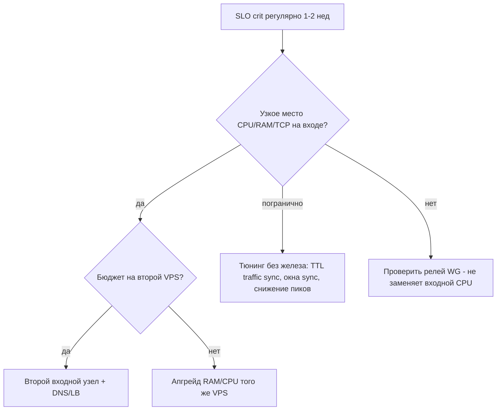

# Решение по ёмкости (capacity decision record)

Документ фиксирует **текущее состояние** узла и **варианты** при регулярных `crit` в SLO. Обновляйте после 1–2 недель baseline.

## Текущий профиль (v3091624, 2026-05-26)

| Параметр | Значение |
|----------|----------|
| vCPU / RAM | 1 / ~2 GiB |
| Активных ключей | ~101 |
| TCP :443 established (типично) | ~1700–2700+ |
| Xray RSS | ~195–235 MiB (`MemoryMax=512M`) |
| SLO | часто **warn/crit** по `est_443`; иногда warn по `xray_rss` |

Пороги: [slo-thresholds.env](../../../scripts/load-protection/slo-thresholds.env). Логи: `/var/log/veil-slo.log`, `/var/log/veil-baseline.log`.

## Критерии выбора варианта



## Варианты (решение)

| Вариант | Когда | Действия |
|---------|-------|----------|
| **A. Тюнинг** | crit эпизодический, дневной пик | Увеличить `traffic_cache_ttl_s`, не вызывать sync-config в пик; baseline 2 нед |
| **B. Апгрейд VPS** | crit >50% проверок 2 нед, 1 узел | 2–4 vCPU, 4 GiB RAM; перенос по playbook хостера |
| **C. Второй узел** | >150–200 ключей или отказоустойчивость | Клон стека, DNS RR / LB, см. [07-scaling.md](07-scaling.md) |
| **D. Снижение нагрузки** | Временная мера | Лимит новых ключей, информирование пользователей о пиках |

## Зафиксированное решение

| Поле | Значение |
|------|----------|
| **Дата решения** | 2026-05-26 |
| **Выбранный вариант** | **A (тюнинг + мониторинг)** → пересмотр **B (апгрейд VPS)** через 2 нед baseline |
| **Обоснование** | На 2026-05-26 в `/var/log/veil-slo.log`: ~725 строк, ~713 `crit` — преимущественно `est_443` выше порога при ~101 ключах; функциональных сбоев API нет. Пороги отражают фактическую нагрузку, не регрессию кода. |
| **Срок пересмотра** | 2026-06-09 (2 нед) или при >120 активных ключах |

## Команды для baseline перед решением

```bash
# Доля crit за последние 7 дней
grep 'level=crit' /var/log/veil-slo.log | wc -l
grep 'level=warn' /var/log/veil-slo.log | wc -l

# Пики TCP и RSS из baseline
awk '/est_tcp/ {print}' /var/log/veil-baseline.log | tail -500
```


## Обновление после внедрения 1.3.15 (2026-05-26)

| Метрика | До правок (пик 26.05) | После правок (днём) |
|---------|----------------------|---------------------|
| TCP ESTAB :443 max | 2888 | ~400–450 типично |
| FIN-WAIT :443 max | 4098 | ~700–800 (всё ещё > ESTAB) |
| connIdle | 1800 → **1200** | Оставить 1200 до weekly baseline |
| traffic_cache_ttl_s | 1800 | **3600** (меньше SQLite в пик) |
| sync config | 101× save | **1× save** (`bulk_sync_vless_clients`) |

**connIdle (п.6):** обрывов не зафиксировано — **1200 без изменений**; пересмотр по `baseline-report.sh 7` на **2026-06-09**.

**Мониторинг:** `check-slo.sh` + `fin_wait_*`; `alert-tcp-pressure.sh`; опциональный `auto-restart-xray-on-tcp.sh` (3× crit подряд, max 1/h).

## Связанные документы

- [02-monitoring-baseline.md](02-monitoring-baseline.md)
- [07-scaling.md](07-scaling.md)
- [PRODUCTION_RUNBOOK.md](../PRODUCTION_RUNBOOK.md)
